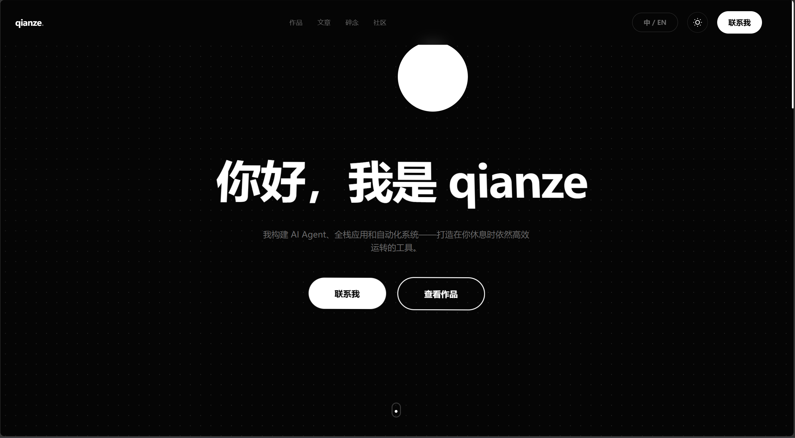
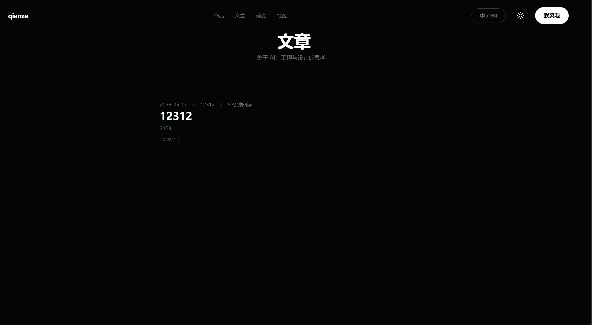
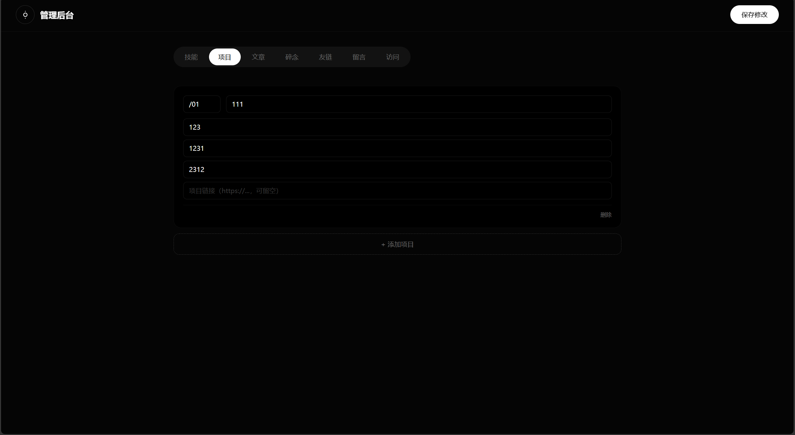
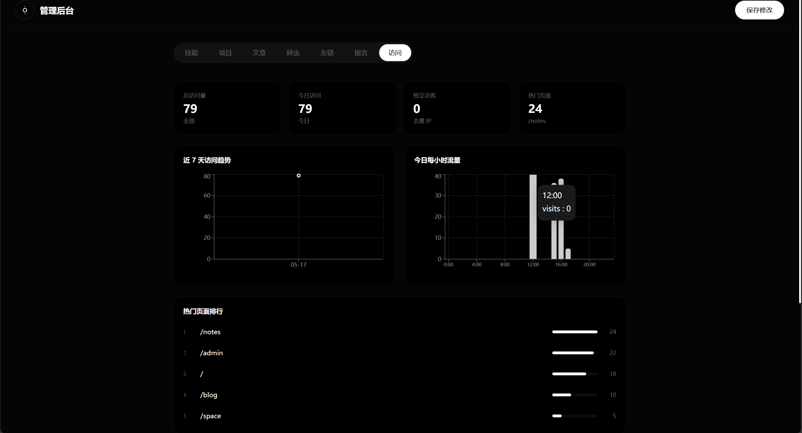

# qianze Blog

<div align="center">

现代化个人博客系统 · React + Spring Boot 全栈项目

<br/>


<br/>
<br/>

一个基于 React + Spring Boot 的现代化个人博客系统，
拥有毛玻璃 UI、3D 动效、JWT 鉴权、访问统计分析等功能。

</div>

---

# ✨ 项目特色

* 🌌 毛玻璃 Glassmorphism UI
* 🎴 3D 翻转卡片动画
* 🌍 中英文双语言切换
* 🔐 JWT 后台认证
* 📊 Recharts 数据分析仪表盘
* 📈 实时访问统计系统
* ⚡ React + Vite 高性能前端
* 🚀 Spring Boot REST API 后端
* 🎨 Framer Motion 页面动画
* 🧩 前后端完全分离架构

---

# 🖼 项目预览

## 首页

<p align="center">
  
</p>

---

## 博客页面

<p align="center">
  
</p>

---

## 管理后台

<p align="center">
  
</p>

---

## 数据分析仪表盘

<p align="center">
  
</p>

---

# 🏗 项目架构

```text
qianze-blog/
├── screenshots/          # README 项目截图
├── blog-react/           # React 前端
├── blog-springboot/      # Spring Boot 后端
└── README.md
```

---

# ⚙ 技术栈

## Frontend

| 技术            | 说明      |
| ------------- | ------- |
| React 18      | 前端框架    |
| Vite          | 构建工具    |
| Tailwind CSS  | 原子化 CSS |
| Framer Motion | 动画系统    |
| Recharts      | 数据可视化   |
| React Router  | 路由系统    |

---

## Backend

| 技术              | 说明       |
| --------------- | -------- |
| Spring Boot 3.3 | Web 后端框架 |
| MyBatis         | ORM 框架   |
| MySQL 8         | 数据库      |
| JWT             | 用户认证     |
| Maven           | 项目管理     |

---

# 📁 项目结构

## Frontend

```text
react/src/
├── api/
├── components/
├── context/
├── hooks/
├── views/
├── App.jsx
└── main.jsx
```

---

## Backend

```text
springboot/src/main/java/com/qianze/
├── controller/
├── service/
├── mapper/
├── entity/
└── config/
```

---

# 🚀 快速启动

# 1️⃣ 克隆项目

```bash
git clone https://github.com/qianze-ui/qianze-blog.git
```

---

# 2️⃣ 启动后端

## 创建数据库

```sql
CREATE DATABASE blog DEFAULT CHARSET utf8mb4;
```

---

## 导入数据表

```bash
mysql -u root -p blog < src/main/resources/migrate.sql
```

---

## 修改配置文件

修改：

```yaml
application.yml
```

中的数据库配置：

```yaml
spring:
  datasource:
    url: jdbc:mysql://localhost:3306/blog
    username: root
    password: yourpassword
```

---

## 启动 SpringBoot

```bash
cd blog-springboot

./mvnw spring-boot:run
```

默认运行：

```text
http://localhost:8080
```

---

# 3️⃣ 启动前端

```bash
cd blog-react

npm install

npm run dev
```

默认运行：

```text
http://localhost:5173
```

---

# 🔐 JWT 登录机制

```text
1. 登录获取 Token
2. localStorage 保存 Token
3. Authorization Header 自动携带
4. JwtFilter 验证 Token
5. Token 默认 1 小时过期
```

请求头：

```http
Authorization: Bearer your_token
```

---

# 📊 数据统计系统

系统支持：

* 页面访问记录
* 今日访问量
* 热门页面排行
* 独立访客统计
* 近 7 天访问趋势
* 每小时流量分析
* 实时访问动态

访问记录由：

```text
useVisit Hook
```

自动发送：

```text
POST /api/visit
```

后端写入：

```text
visit_logs
```

数据库表。

---

# 🎨 UI 与动效

| 功能      | 技术              |
| ------- | --------------- |
| 毛玻璃卡片   | backdrop-filter |
| 3D 卡片翻转 | preserve-3d     |
| 文字视差跟随  | Framer Motion   |
| 页面渐入动画  | whileInView     |
| 数据图表    | Recharts        |
| 点阵背景    | radial-gradient |

---

# 🛠 管理后台

后台地址：

```text
/admin
```

支持：

* 技能管理
* 项目管理
* 博客管理
* 留言管理
* 数据分析
* 实时统计监控

---

# 📌 REST API

| 方法   | 接口                  |
| ---- | ------------------- |
| POST | `/api/auth/login`   |
| GET  | `/api/posts`        |
| GET  | `/api/posts/{slug}` |
| PUT  | `/api/posts`        |
| GET  | `/api/projects`     |
| GET  | `/api/skills`       |
| GET  | `/api/notes`        |
| GET  | `/api/friends`      |
| GET  | `/api/guestbook`    |
| POST | `/api/guestbook`    |
| POST | `/api/visit`        |

---

# 🌟 项目亮点

### 前端

* 高级视觉风格
* 现代化交互动效
* 响应式布局
* 深色模式支持
* 双语言切换

### 后端

* RESTful API
* JWT 鉴权
* MyBatis 注解 SQL
* 访问统计系统
* 数据分析仪表盘

---

# 📦 后续计划

* Markdown 编辑器
* Docker 部署
* Redis 缓存
* Elasticsearch 搜索
* WebSocket 实时通知
* 图片上传系统
* AI 内容辅助生成

---

# 📄 License

MIT License

---

# 👨‍💻 Author

qianze

一个偏向设计感与交互体验的现代化全栈博客项目。
