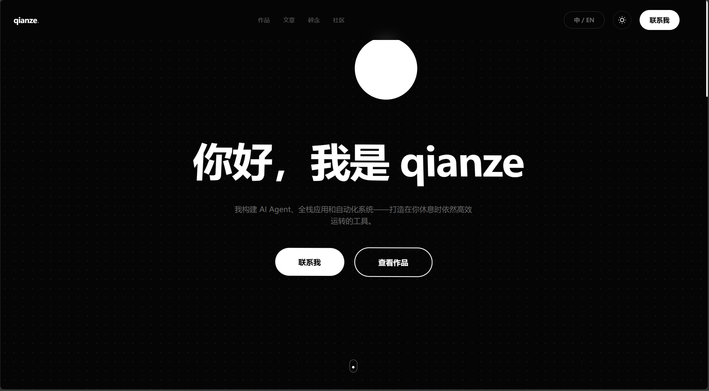
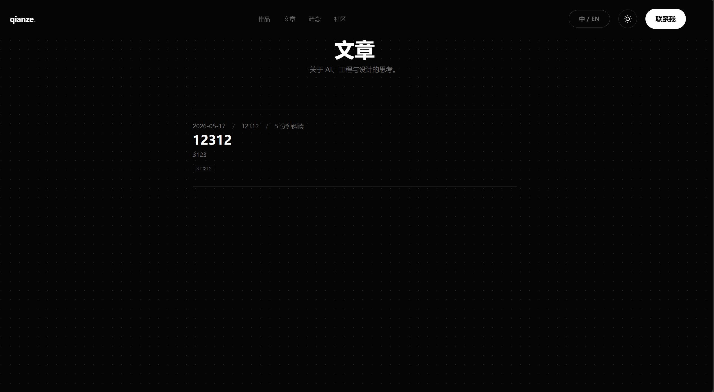
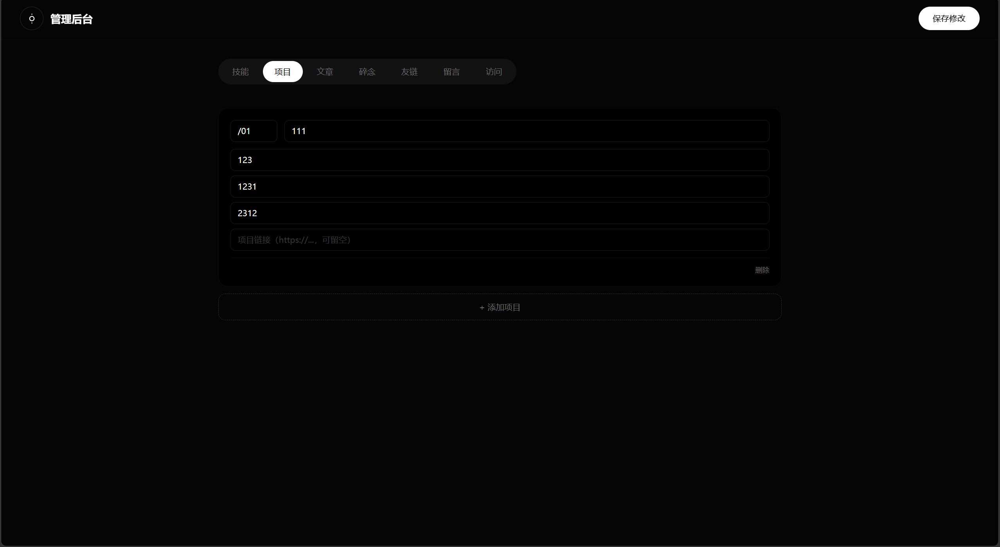
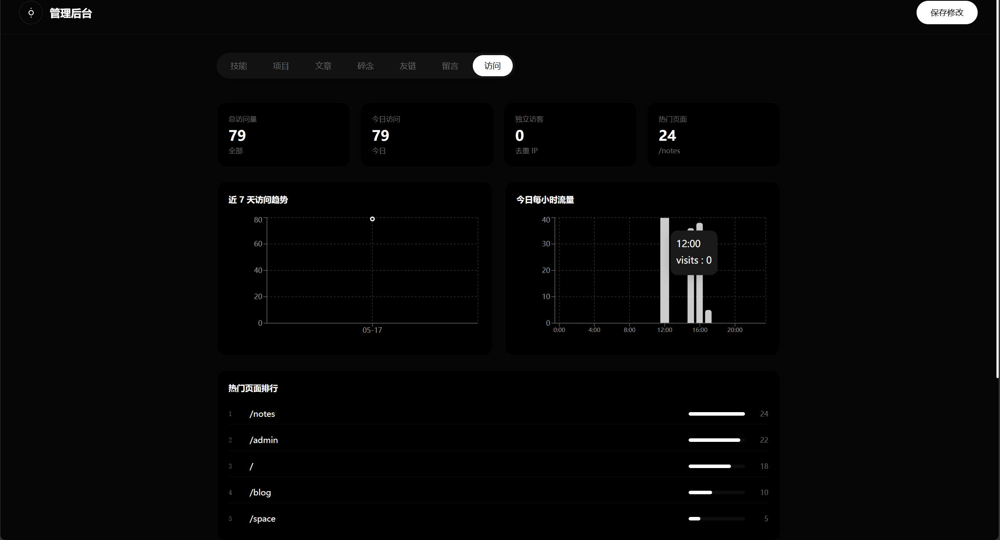

# qianze Blog

<div align="center">

现代化个人博客系统 · React + Spring Boot 全栈项目

<br/>


<br/>
<br/>

> 在线地址：[https://qianze.top](https://qianze.top)

毛玻璃 UI · 3D 动效 · JWT 鉴权 · Mac 风格代码块 · Markdown 渲染 · 中英双语 · 访问统计

</div>

---

# ✨ 项目特色

* 🌌 毛玻璃 Glassmorphism UI
* 🎴 3D 翻转卡片动画
* 🌍 中英文双语言切换
* 🔐 JWT 后台认证
* 📊 Recharts 数据分析仪表盘
* 📈 实时访问统计系统（IP 定位 + 设备识别）
* ⚡ React + Vite 高性能前端
* 🚀 Spring Boot REST API 后端
* 🎨 Framer Motion 页面动画
* 🧩 前后端完全分离架构
* 🍎 **Mac 风格代码块**（红绿灯三圆点窗口）
* ✍️ **Markdown 编辑器**（编辑/预览切换、拖拽 .md 上传、图片插入）
* 📝 **文章管理系统**（草稿/发布状态、定时发布、封面图设置、自动保存）

---

# 🖼 项目预览

## 首页

<p align="center">
  
</p>

---

## 博客页面

<p align="center">
  
</p>

---

## 管理后台

<p align="center">
  
</p>

---

## 数据分析仪表盘

<p align="center">
  
</p>

---

# 🏗 项目架构

```text
qianze-blog/
├── screenshots/          # README 项目截图
├── react/                # React 前端
├── springboot/           # Spring Boot 后端
└── README.md
```

---

# ⚙ 技术栈

## Frontend

| 技术              | 说明               |
| --------------- | ---------------- |
| React 18        | 前端框架             |
| Vite            | 构建工具             |
| Tailwind CSS    | 原子化 CSS          |
| Framer Motion   | 动画系统             |
| Recharts        | 数据可视化            |
| React Router    | 路由系统             |
| marked          | Markdown 渲染      |
| highlight.js    | 代码语法高亮           |
| marked-highlight | marked 代码高亮插件    |
| Zustand         | 状态管理（音乐播放器 store） |

---

## Backend

| 技术              | 说明       |
| --------------- | -------- |
| Spring Boot 3.3 | Web 后端框架 |
| MyBatis         | ORM 框架   |
| MySQL 8         | 数据库      |
| JWT             | 用户认证     |
| Maven           | 项目管理     |

---

# 📁 项目结构

## Frontend

```text
react/src/
├── api/
├── components/
├── context/
├── hooks/
├── views/
├── App.jsx
└── main.jsx
```

---

## Backend

```text
springboot/src/main/java/com/qianze/
├── controller/
├── service/
├── mapper/
├── entity/
└── config/
```

---

# 🚀 快速启动

# 1️⃣ 克隆项目

```bash
git clone https://github.com/qianze0628/qianze-blog.git
```

---

# 2️⃣ 启动后端

## 创建数据库

```sql
CREATE DATABASE blog DEFAULT CHARSET utf8mb4;
```

---

## 导入数据表

```bash
mysql -u root -p blog < src/main/resources/migrate.sql
```

---

## 修改配置文件

修改：

```yaml
application.yml
```

中的数据库配置：

```yaml
spring:
  datasource:
    url: jdbc:mysql://localhost:3306/blog
    username: root
    password: yourpassword
```

---

## 启动 SpringBoot

```bash
cd springboot

# 先跑数据库迁移（幂等安全）
mysql -u root -p blog < src/main/resources/alter.sql

# 启动
./mvnw spring-boot:run
```

默认运行：

```text
http://localhost:8080
```

---

# 3️⃣ 启动前端

```bash
cd react

npm install

npm run dev
```

默认运行：

```text
http://localhost:5173
```

---

# 🔐 JWT 登录机制

```text
1. 登录获取 Token
2. localStorage 保存 Token
3. Authorization Header 自动携带
4. JwtFilter 验证 Token
5. Token 默认 1 小时过期
```

请求头：

```http
Authorization: Bearer your_token
```

---

# 📊 数据统计系统

系统支持：

* 页面访问记录
* 今日访问量
* 热门页面排行
* 独立访客统计
* 近 7 天访问趋势
* 每小时流量分析
* 实时访问动态

访问记录由：

```text
useVisit Hook
```

自动发送：

```text
POST /api/visit
```

后端写入：

```text
visit_logs
```

数据库表。

---

# 🎨 UI 与动效

| 功能 | 技术 |
|------|------|
| Mac 风格代码块（红绿灯） | `pre::before` + `pre::after` + `box-shadow` |
| Markdown 渲染 + 语法高亮 | `marked` + `highlight.js` |
| 毛玻璃卡片 | `backdrop-filter` |
| 3D 卡片翻转 | `preserve-3d` + `rotate-y-180` |
| 文字视差跟随 | Framer Motion `useScroll` |
| 页面渐入动画 | Framer Motion `whileInView` |
| 数据图表 | Recharts |
| 点阵背景 | `radial-gradient` |
| 深色模式 | Tailwind `dark:` class 策略 |
| 全局音乐播放器 | Zustand + Framer Motion |

---

# 🛠 管理后台

后台地址：

```text
/admin
```

支持 9 个管理模块：

| 模块 | 功能 |
|------|------|
| 技能 | 名称、熟练度、中英描述，双向翻译辅助 |
| 项目 | 编号、标题、标签、中英描述、链接 |
| **文章** | **编辑/预览切换、拖拽 .md 上传、图片插入、封面图、草稿/发布状态、定时发布、自动保存草稿** |
| 碎念 | 文字/代码碎碎念 |
| 友链 | 名称、简介、网址 |
| 留言 | 浏览/删除留言（含 IP 地理定位 + 设备信息） |
| 音乐 | 音频、封面、歌词上传，gequhai 曲库搜索导入 |
| 点歌 | 访客点歌记录 + 热门搜索 |
| 访问 | 总访问量/独立访客/今日访问 + Recharts 趋势图表 |

**文章编辑器新增功能（v2）：**

* ✅ 编辑/预览切换 — 按钮切换，`marked` 实时渲染
* ✅ 拖拽 .md 上传 — 自动解析 frontmatter（标题/日期/标签/摘要）
* ✅ 图片上传插入 — 光标位置自动插入 ``
* ✅ 封面图设置 — URL 输入 + 上传按钮 + 缩略图预览
* ✅ 自动保存草稿 — debounced `localStorage`，页面加载提示恢复
* ✅ 定时发布 — checkbox + `datetime-local` 选择器
* ✅ 草稿/已发布状态 — 标签切换（琥珀色草稿 / 绿色已发布）
* ✅ 全中文 UI

---

# 📌 REST API

| 方法 | 接口 | 认证 | 说明 |
|------|------|------|------|
| POST | `/api/auth/login` | 密码 | 登录获取 admin JWT |
| POST | `/api/auth/share` | JWT/密码 | 生成只读分享 Token |
| GET | `/api/posts` | 无 | 全部文章 |
| GET | `/api/posts/{slug}` | 无 | 文章详情 |
| PUT | `/api/posts` | JWT/密码 | 批量替换文章 |
| POST | `/api/upload` | JWT | 文件上传 |
| POST | `/api/upload/public` | 无 | 公开图片上传（限 5MB） |
| GET | `/api/skills` | 无 | 技能列表 |
| PUT | `/api/skills` | JWT/密码 | 批量替换技能 |
| GET | `/api/projects` | 无 | 项目列表 |
| PUT | `/api/projects` | JWT/密码 | 批量替换项目 |
| GET | `/api/notes` | 无 | 碎念列表 |
| PUT | `/api/notes` | JWT/密码 | 批量替换碎念 |
| GET | `/api/friends` | 无 | 友链列表 |
| PUT | `/api/friends` | JWT/密码 | 批量替换友链 |
| GET | `/api/guestbook` | 无 | 留言列表 |
| POST | `/api/guestbook` | 无 | 发表留言 |
| DELETE | `/api/guestbook/{id}` | JWT/密码 | 删除留言 |
| POST | `/api/visit` | 无 | 上报访问记录 |
| GET/POST/PUT/DELETE | `/api/songs` | JWT/密码 | 音乐 CRUD |
| POST | `/api/songs/search` | 无 | 搜索 gequhai 曲库 |
| POST | `/api/songs/import` | JWT/密码 | 导入歌曲 |

---

# 🌟 项目亮点

### 前端

* Mac 风格代码块（红绿灯三圆点窗口）
* Markdown 渲染 + 语法高亮
* 毛玻璃 Glassmorphism UI
* 3D 翻转卡片 + Framer Motion 动效
* 响应式布局 + 深色模式
* 中英双语切换

### 后端

* RESTful API
* JWT 鉴权（支持多密码 + 只读分享 Token）
* MyBatis 注解 SQL（零 XML 映射）
* ip2region IP 地理定位
* 设备/浏览器 UA 解析
* 访问统计 + 数据分析仪表盘

---

# 📦 后续计划

* ✅ ~~Markdown 编辑器~~（v2 已实现）
* ✅ ~~图片上传系统~~（v2 已实现）
* Docker 部署
* Redis 缓存
* RSS 订阅
* 全文搜索
* AI 内容辅助生成

---

# 📄 License

MIT License

---

# 👨‍💻 Author

qianze

一个偏向设计感与交互体验的现代化全栈博客项目。
